# Итоговое домашнее задание — DataOps

## Инфраструктура

Все сервисы развернуты на виртуальной машине в Yandex Cloud:

- **ОС**: Ubuntu 24.04
- **CPU**: Shared-core 2 vCPU (50%)
- **RAM**: 4 GB
- **IP**: 158.160.226.212

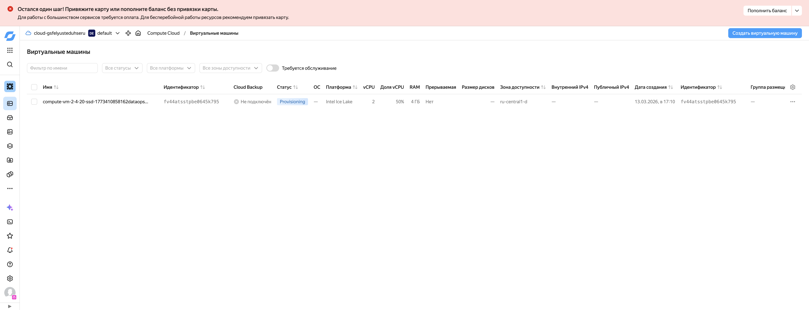

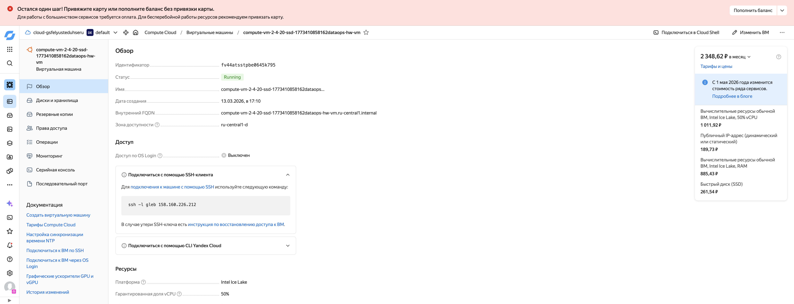

---

## Этап 1. MLflow

**Статус: выполнено**

MLflow развернут через Docker Compose (PostgreSQL + MLflow Server). Backend store — PostgreSQL, артефакты хранятся локально.

- Порт: `5000`
- Файлы: `mlflow/docker-compose.yaml`, `mlflow/Dockerfile`, `mlflow/.env`

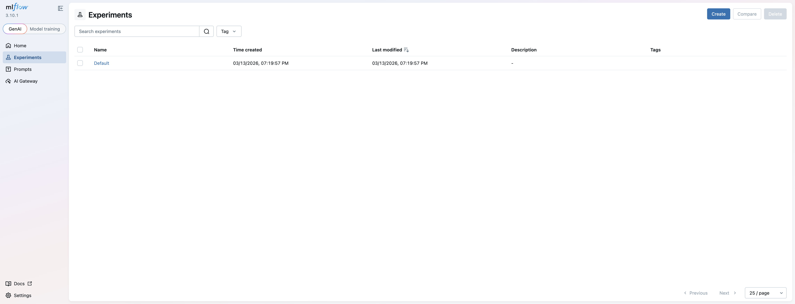

Создан эксперимент `diabetes-prediction` с залогированными параметрами (model, n_estimators, max_depth) и метриками (accuracy, f1_score, rmse):

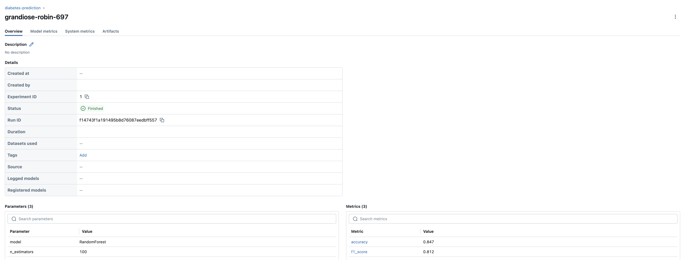

---

## Этап 2. Airflow

**Статус: выполнено**

Apache Airflow развернут через Docker Compose с LocalExecutor. Включает webserver, scheduler и triggerer. Создан пример DAG (`example_dag.py`).

- Порт: `8080`
- Файлы: `airflow/docker-compose.yaml`, `airflow/.env`, `airflow/dags/example_dag.py`

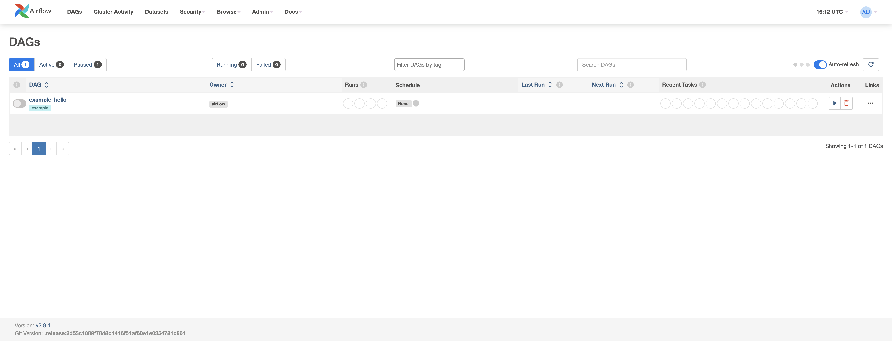

---

## Этап 3. LakeFS

**Статус: выполнено**

LakeFS развернут через Docker Compose с MinIO в качестве blockstore и PostgreSQL для метаданных. Создан репозиторий `ml-data`, выполнены операции с версиями данных:

- Загружен файл `data/diabetes_sample.csv` в ветку `main`, выполнен commit
- Создана ветка `add-labels`, добавлен столбец label, выполнен commit

- Порт: `8000`
- Файлы: `lakefs/docker-compose.yaml`, `lakefs/.env`

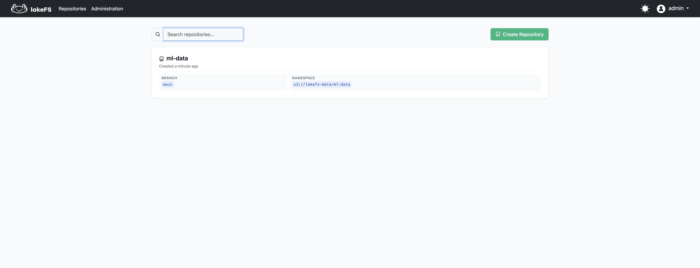

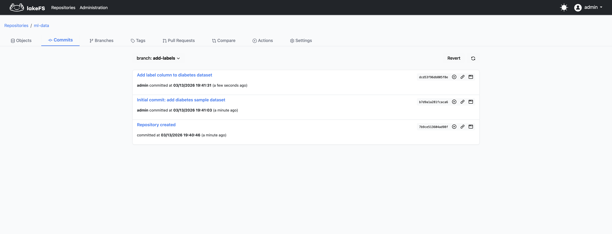

---

## Этап 4. JupyterHub

**Статус: выполнено**

JupyterHub развернут через Docker Compose с использованием официального образа `jupyterhub/jupyterhub:5`. Настроена аутентификация через DummyAuthenticator и LocalProcessSpawner.

- Порт: `8888`
- Файлы: `jupyterhub/docker-compose.yaml`, `jupyterhub/jupyterhub_config.py`, `jupyterhub/.env`

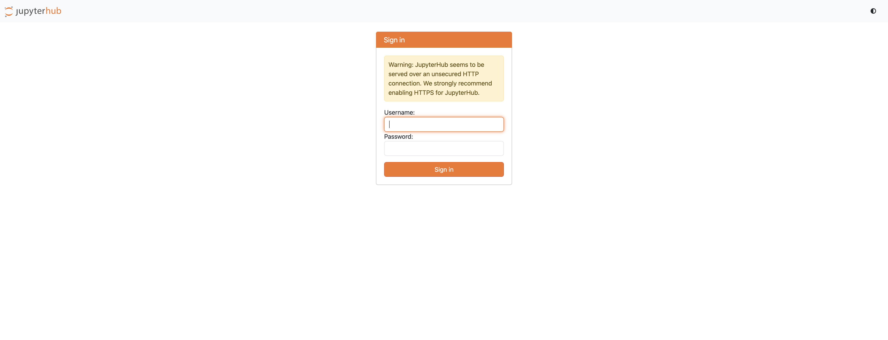

Вход выполнен под пользователем `admin`, запущен JupyterLab:

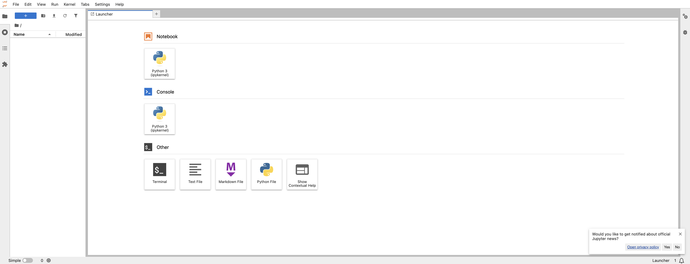

---

## Этап 5. ML-сервис

**Статус: выполнено**

FastAPI-сервис для предсказания диабета (scikit-learn модель). Реализованы:

- Эндпоинт `/api/v1/predict` — предсказание
- Эндпоинт `/health` — проверка здоровья
- Структурированное JSON-логирование
- Логирование предсказаний в PostgreSQL (таблица `prediction_log`)
- Prometheus-метрики на `/metrics`
- Swagger-документация на `/docs`

Порт: `8001`

Файлы: `ml-service/docker-compose.yaml`, `ml-service/Dockerfile`, `ml-service/mlapp/server.py`, `ml-service/model/diabets_model.joblib`

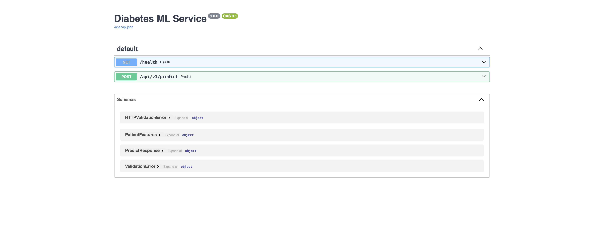

---

## Этап 6. Мониторинг (Prometheus + Grafana)

**Статус: выполнено**

Развернут стек мониторинга:

- **Prometheus** (порт `9090`) — сбор метрик с ML-сервиса и node-exporter
- **Grafana** (порт `3000`) — визуализация, datasource Prometheus провиженен автоматически
- **Node Exporter** (порт `9100`) — системные метрики хоста

Файлы: `monitoring/docker-compose.yaml`, `monitoring/configs/prometheus.yml`, `monitoring/configs/grafana-datasource.yml`

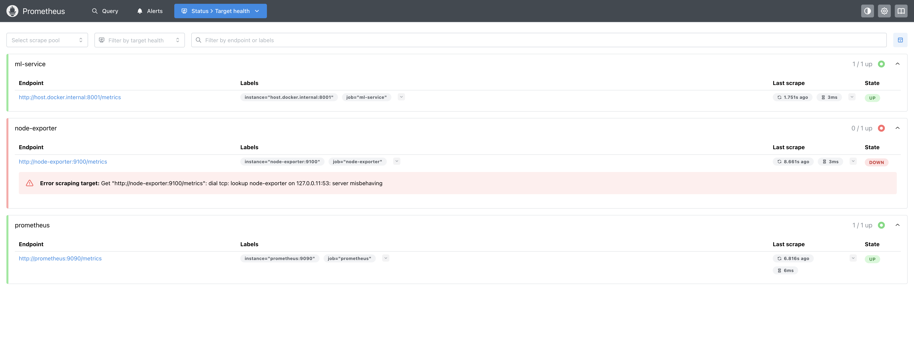

Создан дашборд «ML Service Metrics» с панелями: Request Rate, Request Duration, Total Requests, Requests In Progress, Process Memory:

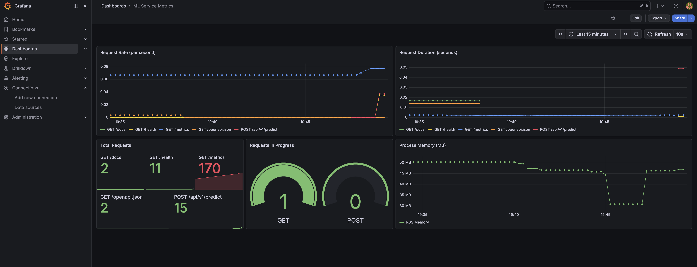

---

## Этап 7. Kubernetes-манифесты

**Статус: выполнено (локально)**

Подготовлены K8s-манифесты для ML-сервиса:

- `deployment.yaml` — 2 реплики, startup/readiness/liveness probes на `/health`, лимиты ресурсов
- `service.yaml` — ClusterIP
- `ingress.yaml` — nginx ingress, хост `ml-service.local`

Файлы: `k8s/deployment.yaml`, `k8s/service.yaml`, `k8s/ingress.yaml`

---

## Этап 8. Helm Chart

**Статус: выполнено (локально)**

Создан Helm chart для ML-сервиса с параметризацией через `values.yaml`:

- Настраиваемые: image tag, replicas, resources, probes, ingress
- Шаблоны: deployment, service, ingress

Файлы: `helm-chart/ml-service/Chart.yaml`, `helm-chart/ml-service/values.yaml`, `helm-chart/ml-service/templates/`

---

## Этап 9. MLflow Prompt Storage

**Статус: выполнено**

Созданы промпты в MLflow Prompt Storage (MLflow 3.10):

- `diabetes_risk_assessment` — 3 версии промпта для оценки риска диабета
- `data_quality_check` — промпт для проверки качества данных

Файлы: `mlflow/create_prompts.py`

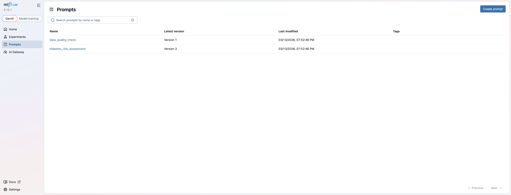

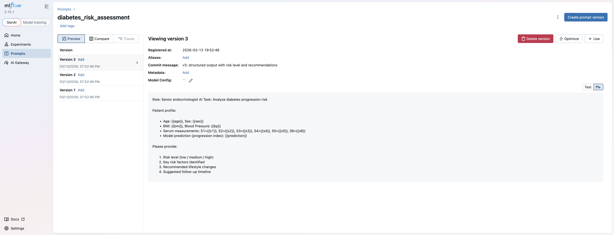

